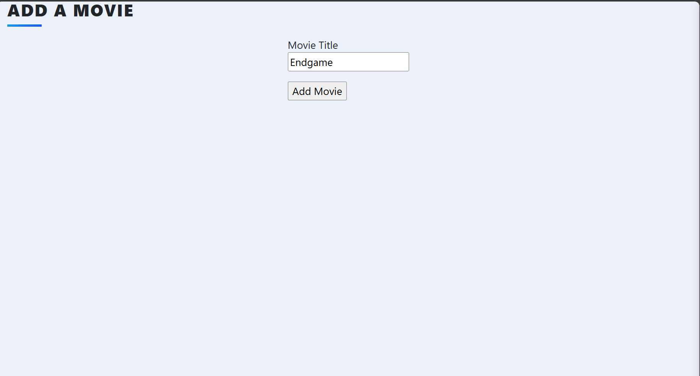
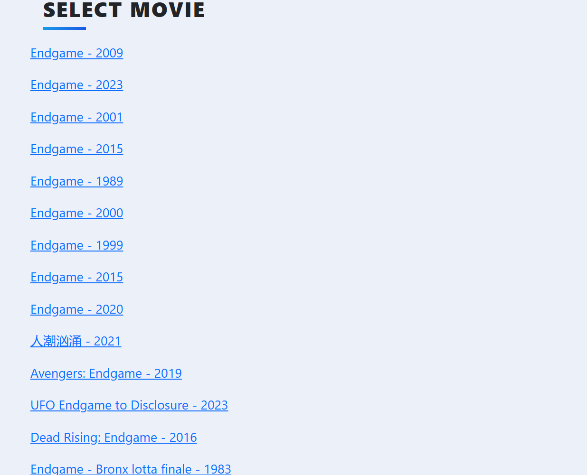
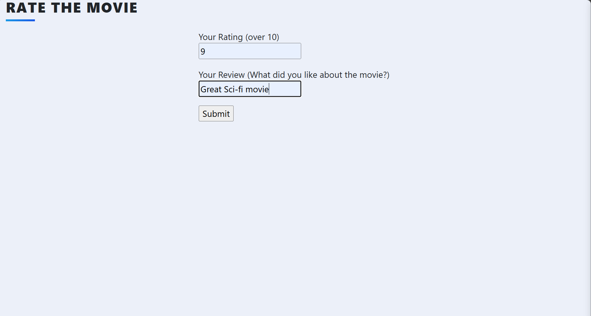
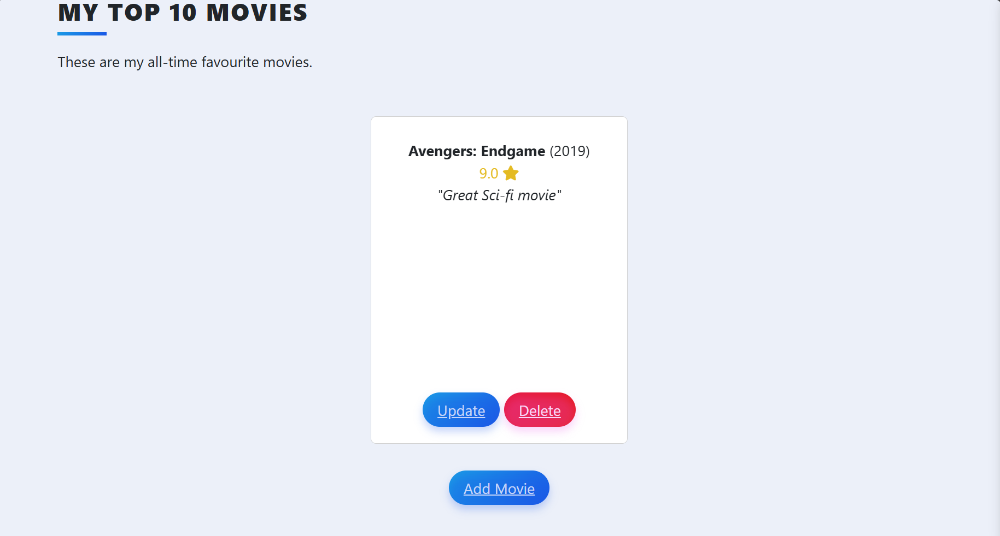

## 🎬 Top Ten Movies App

A simple web application built with **Flask** and **Bootstrap** that lets users search for movies, rate and review them, and store their personal **Top 10 Movies** list. Users can fetch movie data from The Movie Database (TMDb) API and organize their favorite films with custom ratings and reviews.

---

### 📌 Features

* 🔍 **Search for movies** using the TMDb API
* ➕ **Add selected movies** to your personal list with:

  * Title
  * Release year
  * Rating (1–10)
  * Short review
  * Overview from TMDb
* ⭐ **Rate and review movies** via a clean form
* 🗂 **Store and manage** movie entries using a database (SQLAlchemy)
* **Responsive UI** with Bootstrap for styling

---

### 🛠 Tech Stack

* **Backend:** Flask, Flask-WTF, Flask-SQLAlchemy
* **Frontend:** HTML, CSS, Bootstrap
* **Database:** SQLite
* **API:** [The Movie Database (TMDb)](https://www.themoviedb.org/)

---

### 🚀 Getting Started

#### 1. **Clone the repository**

```bash
git clone https://github.com/bowaleos/mytoptenmovies.git
cd mytoptenmovies
```

#### 2. **Create a virtual environment and activate it**

```bash
python -m venv venv
source venv/bin/activate     # On Windows: venv\Scripts\activate
```

#### 3. **Install dependencies**

```bash
pip install -r requirements.txt
```

#### 4. **Set up environment variables (optional)**

Create a `.env` file and store your API keys:

```bash
TMDB_API_KEY=your_tmdb_api_key
TMDB_READ_ACCESS_TOKEN=your_tmdb_token
```

#### 5. **Run the app**

```bash
flask run
```

Then visit `http://127.0.0.1:5000` in your browser.

---

### 📂 Project Structure

```
.
├── static/               # Bootstrap, custom CSS, etc.
├── templates/            # HTML templates (base.html, index.html, rate.html)
├── screenshots/          # Screenshots for README (optional)
├── app.py / main.py      # Flask application
├── models.py             # SQLAlchemy models
├── forms.py              # WTForms
├── requirements.txt
└── README.md
```

---

### 📸 Screenshots

#### 🔍 Movie Search Page

Search for a movie using the TMDb API and choose the correct one.




---

#### ⭐ Rate & Review Page

Submit a rating and review for your selected movie.



---

####  Home Page (Top 10 Movies List)

View your curated list of top 10 favorite movies.





---

### 📌 To-Do / Future Enhancements

* [ ] User authentication (login/logout)
* [ ] Pagination for search results
* [ ] Movie posters from TMDb
* [ ] Responsive Top 10 display using Bootstrap cards

---

### 📜 License

This project is open-source and available under the [MIT License](LICENSE).

